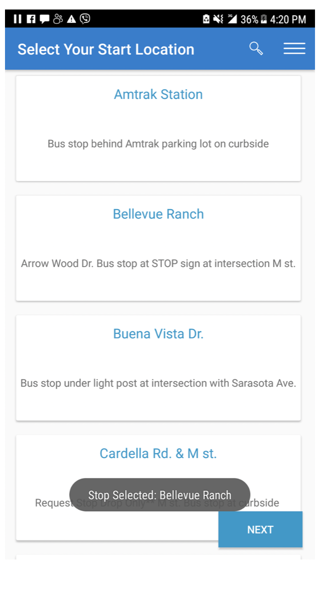
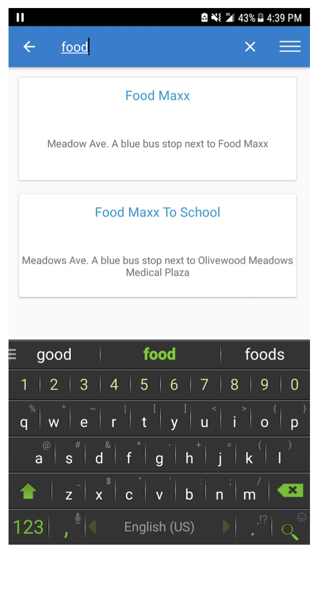
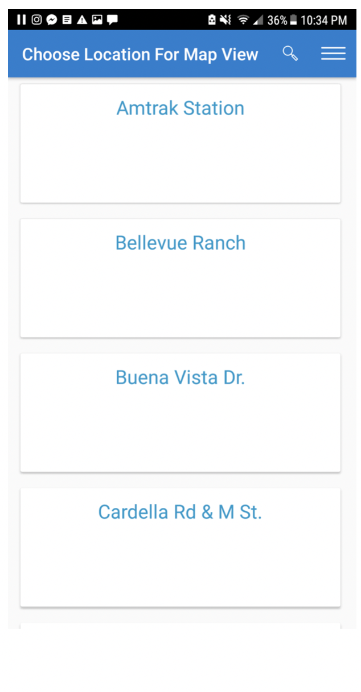
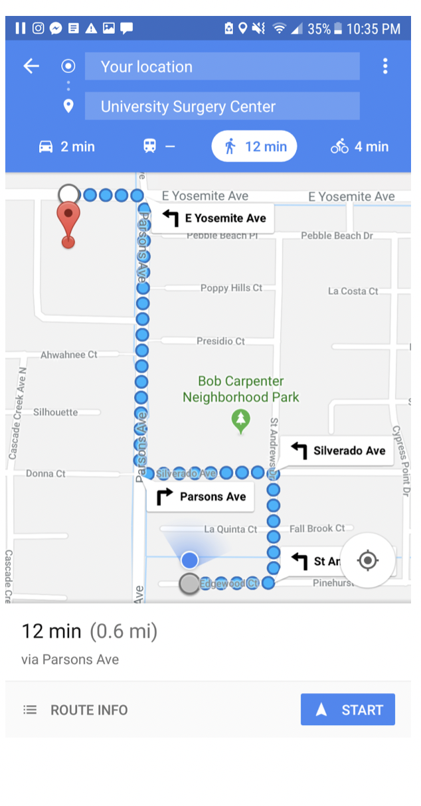
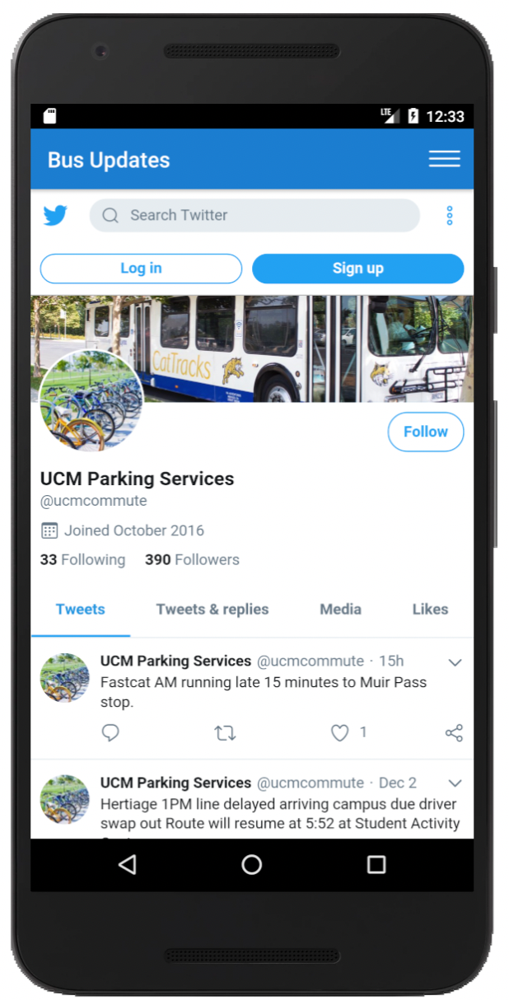
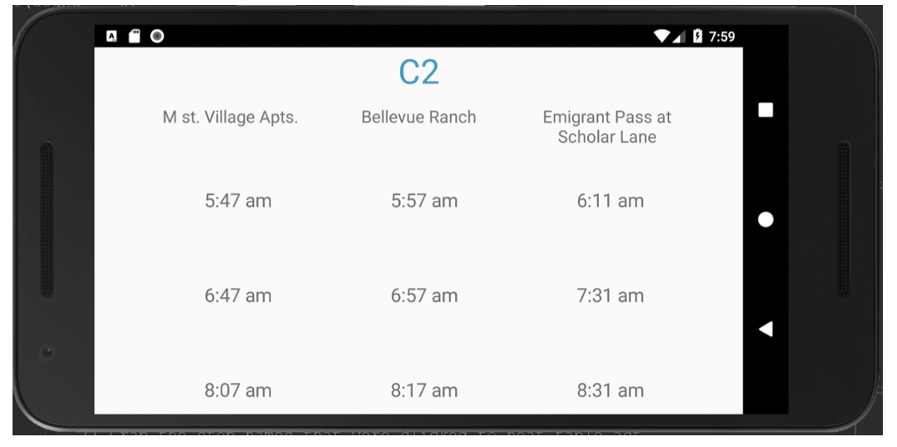

__Overview:__ 
CatTracks is an application designed for the University of California Merced's bus system that provides users (students) a fast and interactive way to reach a desired destination.

__Features:__
 

* Trip planing

* Bus stop directions

* Bus updates Twitter feed

* Comprehensive bus schedules

